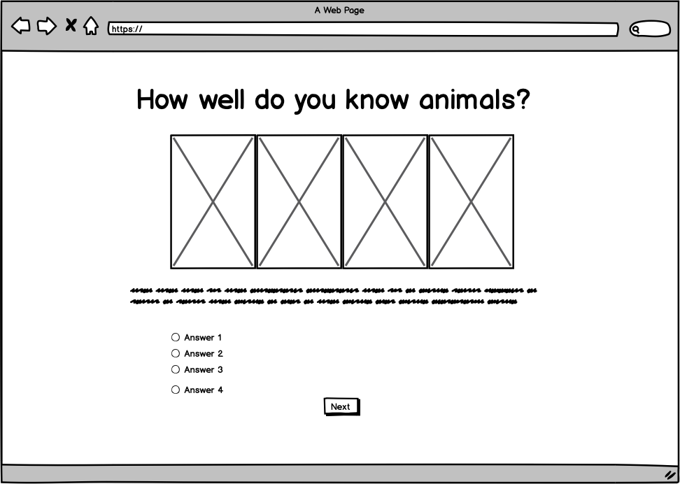

# *Animal Trivia Quiz* - Milestone Project 2 for Code Institute

The Animal Trivia Quiz was created using the skills learned during the first seven modules of the Full Stack Web Development course. The goal of this project was to create a mobile-first fully responsive quiz using HTML, CSS, and Javascript.

This quiz is designed to entertain users while also teaching them some random facts about our co-inhabitants of the world. The layout of the quiz is meant to be minimalistic, making it easy to follow along and see results.

Here is a link to the repository: https://github.com/debrawolford/animal-quiz.git

Here is a link to the live preview: https://debrawolford.github.io/animal-quiz/

## UX design

### The Strategy Plane

* The primary site goals are to offer a fun experience to users while teaching them some facts about animals.

* The primary user goals are to learn more about animals while testing their knowledge.

#### Who is the primary audience for this website?
* Animal lovers who want to see how much they know about animals and be able to share this information with their friends.

#### How are we presenting the content?
* With a minimalistic style that makes navigating the quiz very straightforward.

####  Who else has done this and what have they done well/could be done better?
* [National Geographic](https://kids.nationalgeographic.com/games/quizzes/quiz-whiz-animals/):
  * The counter at the top showing how many questions are left and which ones were answered correctly is really nice.
  * The color scheme is a bit too much in my opinion. It takes away from the images some times (like the one of the giraffe).
  * I like the immediate feedback with more information.

### The Scope Plane

#### Sample User Stories

User Story | Requirements for User
------------ | -------------
As a family, we want to take the quiz and compare our results. | A page at the end of the quiz displaying the amount of questions people have gotten correct and how well they did compared to others. Maybe a high score list or a way to share results via email or social media.
As someone without a computer, I want to take the quiz on my phone and still get all the same information. | A responsive, simple design is needed that will render well on phones. Making the text smaller and removing the images so that all the information can still be displayed properly.
As someone who doesn't know much about animals, I want to learn some new things while taking this quiz. | Offer extra information as feedback every time a question is answered. And at the end of the quiz recommend they read the book *animalkind*, which will give them the chance to learn even more.
As someone who isn't too tech-savvy, I still want to be able to take the quiz. | The quiz should be very straightforward, with minimal buttons and navigation menus. Simply the choices and a "Next" button should be enough.  

### The Structure Plane

(a) **Is it consistent?** The color pattern, the fonts and the header/footer will be the same on every page.

(b) **Is it predictable?** The header has the page title and each page has a straightforward design with one question, 4 options, and a next button.

(c) **Is it learnable?** When hovering over buttons the mouse will change to a hand to allow the user to see that they can select the option.

(d) **Is it visible?** Everything is visible when loading the page. There is no scrolling needed until the feedback pops up, but by that point the user will have already seen the next button below.

(e) **Does it provide clear feedback?** Every time a user selects an answer they are immediately told whether it is correct or incorrect. At the end of the quiz they will get more detailed results showing how many they got correct in total.

### The Skeleton Plane

Below are the wireframes for desktop. [Click here](https://github.com/debrawolford/animal-quiz/tree/master/wireframes) to see all the wireframes for this project.

## Features

### Existing Features

* Immediate feedback: Users get feedback letting them know whether they answered correctly as soon as they select an answer.
* Easy navigation: Navigating the quiz is very straightforward, with a "Next" button for users to select each time they have finished reading their feedback. At the end of the quiz there is a "Try again" button which will let users start the quiz over.
* Results and different responses depending on how well the user did after completing the quiz.
* All images and GIFs have an alt tag for screen readers and in case the image doesn't load properly.
* Mobile responsiveness: The website has been designed with both mobile and desktop users in mind. All of the header images disappear when viewing the website from a small screen in order to save space. The text and map become become smaller, and the entire container takes up more percentage of the screen than on a desktop.
* The external link for *animalkind* has a target="blank" attribute which will pop open a new window so users don't leave the website.
* A map on question 8 that has 4 possible locations (randomly selected each time the quiz is loaded). The code for this map can be found in the file [question-8.js](https://github.com/debrawolford/animal-quiz/blob/master/assets/js/question-8.js).

### Possible Future Features

* Required Radio Buttons: Unfortunately I was not able to resolve this issue even after testing several options in both the html and javascript files. So leaving for a later date.

* An option to share the results with friends and family via Social Media and Email

* Additional questions that are randomly selected to be a part of the quiz each time, similar to the map question, which would make the quiz more enjoyable to repeat multiple times.

## Technologies Used

* HTML: This was the language used to add all the initial content to the quiz.
* CSS: Cascading Style Sheets language used to style the quiz in conjunction with Bootstrap.
* Javascript: Javascript was used to store the score of the quiz, give feedback after each question, show the results after completing, and generate a random map for question 8.

### Tools

* [Bootstrap](https://www.getbootstrap.com/): Used for initial styling.
* [Atom](https://www.atom.io/): The code editor used for this project.
* [Git](https://git-scm.com/): Installed on Atom as a plugin to allow version control.
* [Balsamiq Mockups](https://balsamiq.com/) : Used to create the wireframes during the UX Design process.
* Chrome Developer Tools: Used to test the responsiveness of the website while developing.
* [Autoprefixer](https://autoprefixer.github.io/): Added vendor prefixes to CSS for different browsers.
* [W3C Markup Validation Jigsaw](https://jigsaw.w3.org/css-validator/): To validate the CSS code.
* [W3C Markup Validation](https://validator.w3.org/): To validate the HTML code.
* [Esprima](https://esprima.org/demo/validate.html): To validate JS code.
* [Pixabay](https://www.pixabay.com/): Downloaded all images from this library.
* [GIPHY](https://giphy.com/): Downloaded all GIFs used from this library.
* [Color Picker](https://colorsupplyyy.com/app/): The colors for the header/footer and buttons were matched together using Color Picker.
* [Github](https://www.github.com/): Used to host the repositories for this project and the live website preview.
* [Canva](https://www.canva.com/): Used to resize images and create collages.
* [Google Fonts](https://fonts.google.com/): Used to get fonts used in the quiz (Hind Siliguri).
* [Jquery](https://jquery.com/) : Used within script.js to make manipulating the DOM more straightforward.
* [Google Maps API](https://developers.google.com/maps/documentation/javascript/adding-a-google-map?hl=en_US): Used to generate random map markers for question 8.
* [Am I Responsive](http://ami.responsivedesign.is/): Used to get a screenshot of different screen sizes for README file.

## Testing

Chrome Developer Tools was used throughout the duration of my project to test out how the website rendered on different viewports/devices. While writing the HTML and CSS, whenever a change was made I used the device selector and looked at each screen size to confirm that everything looked as it should. If something didn't look correct, I edited the code within Chrome Developer to see my changes as I typed them. Once the issue was resolved, I would add it to my project in Atom.

The index.html page has been viewed and tested in Chrome, Firefox and Safari browsers. Everything renders correctly on both desktop and mobile versions of each browser. At the start of the project the images weren't centering properly on mobile, but this was resolved by adding the bootstrap text-center and mx-auto classes.

During the initial project review with my mentor, the idea of adding in the random map function for question 8 was brought up. This idea was then tested initially in a separate html and js file. Once it worked properly it was added to the main quiz.

There was and still is an issue with the user not being required to select a radio button before clicking next. I tried to resolve this by adding the required attribute but that didn't work. I also tried an if...else statement which would alert the user if a radio button wasn't selected when pressing the next button. But even though the alert would pop up correctly, it would pop up as well even when a radio button was selected. I hope to return to this issue at a later date to resolve it.  

* Navigating the quiz and testing results. These were all done on Safari and Chrome for desktop, and Safari and Chrome for mobile.
  * Tried selecting only incorrect answers to see if negative feedback would be given each time: success
  * Tried submitting quiz after only selecting incorrect answers each time: the results page told me "You got everything wrong!".
  * Tried selecting only correct answers to see if positive feedback would be given each time: success
  * Tried submitting quiz after only selecting correct answers each time: the results page told me "Wow! You answered everything correctly!".
  * Tried submitting quiz after selecting one correct answer and the rest incorrect. The results page told me "You only got 1 out of 8 correct...".
  * Tried submitting quiz after selecting 6 correct questions and 2 incorrect. The results page told me "You got 6 out of 8 correct!"
  * Selected "Try Again" button on results page: was taken back to question 1 with a different randomly generated map for question 8.

* Testing Random Map functionality
  * Refreshed quiz multiple times until each of the four maps and answer order appeared: success
  * Tried answering the map question correctly and incorrectly with each of the four options to make sure that the results and feedback were always produced correctly: success.

W3C Markup Validation was used to ensure that all of the HTML and CSS code hold up to industry standards:

When testing index.html: Got an error stating that "the main element must not appear as a descendant of the section element." So I moved the main tags outside of the section element. I also got an error saying that "Attribute checked not allowed on element label at this point." I must have forgotten that attribute there when testing the radio buttons so I removed it. There were also three warnings saying that "The type attribute is unnecessary for JavaScript resources." so I removed those. I then tested the html again and got the following message: "Document checking completed. No errors or warnings to show."

When testing style.css: "Congratulations! No Error Found."

[Esprima](https://esprima.org/demo/validate.html) was used to validate the Javascript code and make sure there were no syntax errors:

When testing script.js: "Code is syntactically valid."

When testing question-8.js: "Code is syntactically valid."

### User Stories Testing

User Story | Results
------------ | -------------
As a family, we want to take the quiz and compare our results. | At the end of the quiz there is the total correct answers and the option to try again for multiple users. No social sharing or high score has been added as of now.
As someone without a computer, I want to take the quiz on my phone and still get all the same information. | All the questions and answers are easy to read on mobile devices. As the images are hidden the text is larger and there is no need for scrolling when selecting an answer.
As someone who doesn't know much about animals, I want to learn some new things while taking this quiz. | After every question there is feedback with extra information and at the end of the quiz there is a hyperlink to purchase the book *animalkind*, which will allow users to learn more random facts.
As someone who isn't too tech-savvy, I still want to be able to take the quiz. | When starting the quiz there is only the question, the possible answers, and a next button. As soon as an answer is selected the user will get feedback without needing to click anywhere else. There is no timer or anything that will make them feel rushed in figuring out what to do next. So as soon as they are finished reading their feedback they can click on "Next". This same process is repeated until the quiz is finished.

## Deployment

The Animal Trivia Quiz project has been built using Atom, a desktop code editor. It has been committed to Git and Pushed to GitHub using the terminal within Atom.

### Deploying the website from GitHub

1. Logged in to Github
2. Navigated to the repository from the Github Dashboard
3. Scrolled to the *Settings* icon and then down to the *Github Pages* section
4. Under *Source*, clicked on the dropdown menu and selected *Master Branch*
5. When *Master Branch* was selected, the page needed to be refreshed
6. The link to website could then be found under the *GitHub Pages* section with the following text: "Your site is published at https://debrawolford.github.io/animal-quiz/"

### Cloning the repository

Take the following steps to clone the website:

1. Navigate to the repository from the Github Dashboard
2. Select the green button in the top right of the screen that says "Clone or download"
3. Click on the clipboard icon to the right of the URL to copy it
4. Open an Integrated Development Environment (IDE) and head over to the terminal
5. Change the directory to where you want to clone the repository to
6. Execute the following command by pasting in the URL you copied in step 3: git clone https://github.com/debrawolford/animal-quiz.git
7. Press Enter
8. The site will then be cloned

## Credits

### Content

Some questions were created using information from the book [*animalkind*](https://headlines.peta.org/animalkind-book-newkirk-stone/) by Ingrid Newkirk and Gene Stone. All other information originated from [Wikipedia](https://www.wikipedia.org/).

The Google Map API used in question 8 code was initially taken from [developers.google.com](https://developers.google.com/maps/documentation/javascript/adding-a-google-map?hl=en_US) and adapted to load randomly depending on which animal was the correct answer.

The random question generator for question 8 was created with the initial help of the tutorial [*Build a Quiz App*](https://www.youtube.com/watch?v=u98ROZjBWy8) by James Q Quick on Youtube and then adapted to this project.

### Media

All of the header images above each question were taken from [Pixabay](https://pixabay.com/), a website that offers free stock images. They were then edited using [Canva](https://www.canva.com/).

All of the GIFs in the feedback and results sections have been downloaded from [GIPHY](https://giphy.com/) and resized using [EZGIF.com](https://ezgif.com/resize).

## Acknowledgements

Thanks to my mentor, Dick Vlaanderen for giving suggestions that challenged me and improved the overall project.
